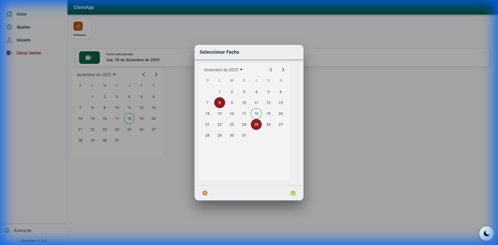

# Caso Calendario - Colombian Holidays & Calendar Visibility Fix

Implementación de lógica de festivos colombianos y resolución del problema crítico de visibilidad de días en el modal ion-datetime.

## Cambios Realizados

### Integración de Festivos
- **[Nuevo] Holiday Service**: Creado `holiday.service.ts` con festivos colombianos (2025-2039).
- **Resaltado Exclusivo**: El calendario solo resalta festivos con **círculos rojos**.
- **Resaltado de Hoy**: El día actual muestra un **borde verde/color primario**.

### Corrección de Visibilidad del Calendario (Crítico)

> [!IMPORTANT]
> Los días del calendario eran invisibles debido a **altura insuficiente del modal** - el contenido estaba siendo cortado.

**Causa Raíz**: Modal tenía `--height: auto` que colapsaba a altura mínima (~100px), cortando el contenido de ion-datetime.

**Solución Aplicada** en [global.scss](file:///d:/CLASSAPP/src/global.scss):
```scss
ion-modal.calendar-modal {
  --height: 600px;
  --min-height: 600px;
  --width: 100%;

  ion-datetime {
    min-height: 450px;
    height: 450px;
  }
}
```

### Estructura del Modal
- Sigue las [Mejores Prácticas de Modal de Ionic](https://ionicframework.com/docs/api/modal#styling)
- Los estilos son **globales** (el modal se renderiza en la raíz de la app, no en el DOM del componente)
- Usa estructura `ion-header`, `ion-content`, `ion-footer`

## Resultados de Verificación

### Visibilidad del Calendario Confirmada


### Resumen de Pruebas
- ✅ Días del calendario (1-31) visibles en el modal
- ✅ Festivos muestran círculos rojos de resaltado
- ✅ Fecha actual tiene borde verde/primario
- ✅ Botones Aceptar (check verde) y Cancelar (X naranja) funcionales
- ✅ Selección de fecha actualiza el textfield correctamente
